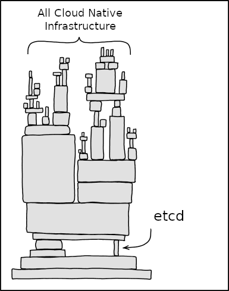

# etcd

[](https://goreportcard.com/report/github.com/etcd-io/etcd)
[](https://app.codecov.io/gh/etcd-io/etcd/tree/main)
[](https://github.com/etcd-io/etcd/actions/workflows/tests.yaml)
[](https://github.com/etcd-io/etcd/actions/workflows/codeql-analysis.yml)
[](https://etcd.io/docs)
[](https://godoc.org/github.com/etcd-io/etcd)
[](https://github.com/etcd-io/etcd/releases)
[](https://github.com/etcd-io/etcd/blob/main/LICENSE)
[](https://api.securityscorecards.dev/projects/github.com/etcd-io/etcd)

**Note**: The `main` branch may be in an *unstable or even broken state* during development. For stable versions, see [releases][github-release].


etcd is a distributed reliable key-value store for the most critical data of a distributed system, with a focus on being:

* *Simple*: well-defined, user-facing API (gRPC)
* *Secure*: automatic TLS with optional client cert authentication
* *Fast*: benchmarked 10,000 writes/sec
* *Reliable*: properly distributed using Raft

etcd is written in Go and uses the [Raft][] consensus algorithm to manage a highly-available replicated log.

etcd is used [in production by many companies](./ADOPTERS.md), and the development team stands behind it in critical deployment scenarios, where etcd is frequently teamed with applications such as [Kubernetes][k8s], [locksmith][], [vulcand][], [Doorman][], and many others. Reliability is further ensured by rigorous [**robustness testing**](https://github.com/etcd-io/etcd/tree/main/tests/robustness).

See [etcdctl][etcdctl] for a simple command line client.



<sub>Original image credited to  xkcd.com/2347, alterations by Josh Berkus.</sub>

[raft]: https://raft.github.io/
[k8s]: http://kubernetes.io/
[doorman]: https://github.com/youtube/doorman
[locksmith]: https://github.com/coreos/locksmith
[vulcand]: https://github.com/vulcand/vulcand
[etcdctl]: https://github.com/etcd-io/etcd/tree/main/etcdctl

## Maintainers

[MAINTAINERS](MAINTAINERS) strive to shape an inclusive open source project culture where users are heard and contributors feel respected and empowered. MAINTAINERS maintain productive relationships across different companies and disciplines. Read more about [MAINTAINERS role and responsibilities](Documentation/contributor-guide/community-membership.md#maintainers).

## Getting started

### Getting etcd

The easiest way to get etcd is to use one of the pre-built release binaries which are available for OSX, Linux, Windows, and Docker on the [release page][github-release].

For more installation guides, please check out [play.etcd.io](http://play.etcd.io) and [operating etcd](https://etcd.io/docs/latest/op-guide).

[github-release]: https://github.com/etcd-io/etcd/releases

### Running etcd

First start a single-member cluster of etcd.

If etcd is installed using the [pre-built release binaries][github-release], run it from the installation location as below:

```bash
/tmp/etcd-download-test/etcd
```

The etcd command can be simply run as such if it is moved to the system path as below:

```bash
mv /tmp/etcd-download-test/etcd /usr/local/bin/
etcd
```

This will bring up etcd listening on port 2379 for client communication and on port 2380 for server-to-server communication.

Next, let's set a single key, and then retrieve it:

```bash
etcdctl put mykey "this is awesome"
etcdctl get mykey
```

etcd is now running and serving client requests. For more, please check out:

* [Interactive etcd playground](http://play.etcd.io)
* [Animated quick demo](https://etcd.io/docs/latest/demo)

### etcd TCP ports

The [official etcd ports][iana-ports] are 2379 for client requests, and 2380 for peer communication.

[iana-ports]: http://www.iana.org/assignments/service-names-port-numbers/service-names-port-numbers.txt

### Running a local etcd cluster

First install [goreman](https://github.com/mattn/goreman), which manages Procfile-based applications.

Our [Procfile script](./Procfile) will set up a local example cluster. Start it with:

```bash
goreman start
```

This will bring up 3 etcd members `infra1`, `infra2` and `infra3` and optionally etcd `grpc-proxy`, which runs locally and composes a cluster.

Every cluster member and proxy accepts key value reads and key value writes.

Follow the comments in [Procfile script](./Procfile) to add a learner node to the cluster.

### Install etcd client v3

```bash
go get go.etcd.io/etcd/client/v3
```

### Next steps

Now it's time to dig into the full etcd API and other guides.

* Read the full [documentation].
* Review etcd [frequently asked questions].
* Explore the full gRPC [API].
* Set up a [multi-machine cluster][clustering].
* Learn the [config format, env variables and flags][configuration].
* Find [language bindings and tools][integrations].
* Use TLS to [secure an etcd cluster][security].
* [Tune etcd][tuning].

[documentation]: https://etcd.io/docs/latest
[api]: https://etcd.io/docs/latest/learning/api
[clustering]: https://etcd.io/docs/latest/op-guide/clustering
[configuration]: https://etcd.io/docs/latest/op-guide/configuration
[integrations]: https://etcd.io/docs/latest/integrations
[security]: https://etcd.io/docs/latest/op-guide/security
[tuning]: https://etcd.io/docs/latest/tuning

## Contact

* Email: [etcd-dev](https://groups.google.com/forum/?hl=en#!forum/etcd-dev)
* Slack: [#etcd](https://kubernetes.slack.com/messages/C3HD8ARJ5/details/) channel on Kubernetes ([get an invite](http://slack.kubernetes.io/))
* [Community meetings](#community-meetings)

### Community meetings

etcd contributors and maintainers meet every two weeks at 11:00 AM (USA Pacific) on Thursday.

An initial agenda will be posted to the [shared Google docs][shared-meeting-notes] a day before each meeting, and everyone is welcome to suggest additional topics or other agendas.

Meeting recordings are uploaded to official etcd [YouTube channel].

Get calendar invitation by joining [etcd-dev](https://groups.google.com/forum/?hl=en#!forum/etcd-dev) mailing group.

Join Hangouts Meet: [meet.google.com/umg-nrxn-qvs](https://meet.google.com/umg-nrxn-qvs)

Join by phone: +1 405-792-0633‬ PIN: ‪299 906‬#

[shared-meeting-notes]: https://docs.google.com/document/d/16XEGyPBisZvmmoIHSZzv__LoyOeluC5a4x353CX0SIM/edit
[YouTube channel]: https://www.youtube.com/channel/UC7tUWR24I5AR9NMsG-NYBlg

## Contributing

See [CONTRIBUTING](CONTRIBUTING.md) for details on setting up your development environment, submitting patches and the contribution workflow.

Please refer to [community-membership.md](Documentation/contributor-guide/community-membership.md#member) for information on becoming an etcd project member.  We welcome and look forward to your contributions to the project!

Please also refer to [roadmap](Documentation/contributor-guide/roadmap.md) to get more details on the priorities for the next few major or minor releases.

## Reporting bugs

See [reporting bugs](https://github.com/etcd-io/etcd/blob/main/Documentation/contributor-guide/reporting_bugs.md) for details about reporting any issues. Before opening an issue please check it is not covered in our [frequently asked questions].

[frequently asked questions]: https://etcd.io/docs/latest/faq

## Reporting a security vulnerability

See [security disclosure and release process](security/README.md) for details on how to report a security vulnerability and how the etcd team manages it.

## Issue and PR management

See [issue triage guidelines](https://github.com/etcd-io/etcd/blob/main/Documentation/contributor-guide/triage_issues.md) for details on how issues are managed.

See [PR management](https://github.com/etcd-io/etcd/blob/main/Documentation/contributor-guide/triage_prs.md) for guidelines on how pull requests are managed.

## etcd Emeritus Maintainers

These emeritus maintainers dedicated a part of their career to etcd and reviewed code, triaged bugs and pushed the project forward over a substantial period of time. Their contribution is greatly appreciated.

* Fanmin Shi
* Anthony Romano
* Brandon Philips
* Joe Betz
* Gyuho Lee
* Jingyi Hu
* Xiang Li
* Ben Darnell
* Sam Batschelet

### License

etcd is under the Apache 2.0 license. See the [LICENSE](LICENSE) file for details.
